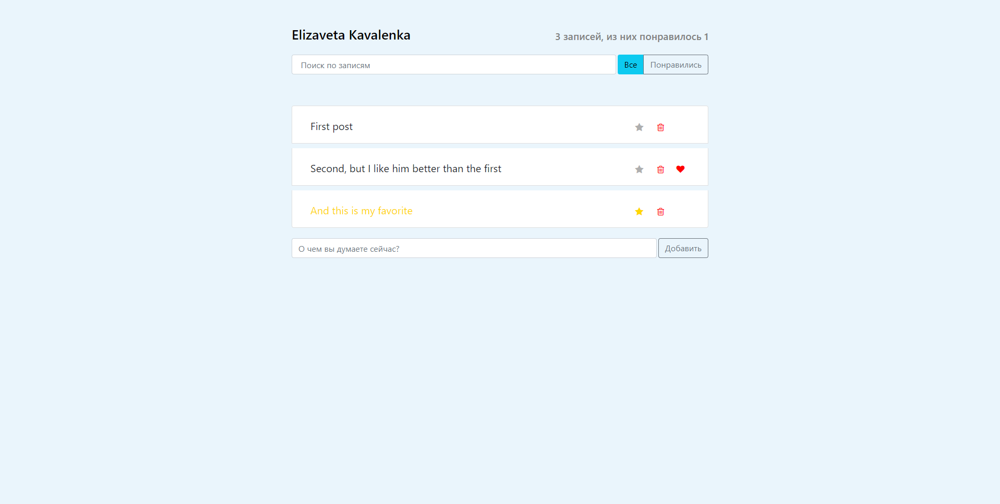
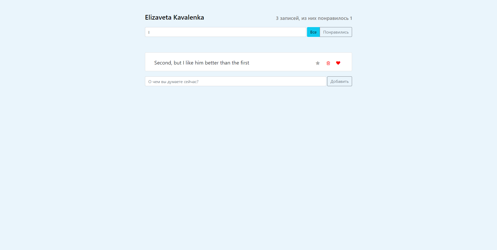

# Twitt app

This project was bootstrapped with [Create React App](https://github.com/facebook/create-react-app).

## Available Scripts

In the project directory, you can run:

### `npm start`

You can create and delete messages.
Add posts to favorites or likes.

Show only the posts you like. Search for messages using the search bar.

This project uses styled components and react bootstrap.
